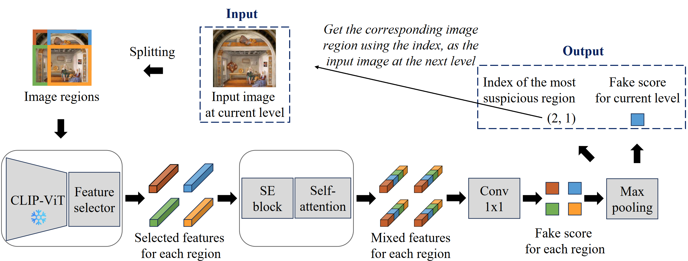

# Towards Generalizable and Interpretable AI-Modified Image Detectors

Official implementation of the ICANN 2024 paper [Towards Generalizable and Interpretable AI-Modified Image Detectors](https://link.springer.com/chapter/10.1007/978-3-031-72341-4_17). 

<p align="middle">
    
</p>

## Data Preparation
Please download the dataset from [Kaggle](https://www.kaggle.com/datasets/danielmao2019/deepfakeart), and organize the images following the `data_list.json` in this repo.

## One Command to Reproduce the Results

```sh
bash reproduce.sh
```

It will task two days on a single NVIDIA GeForce RTX 4090.

## Step-by-Step Evaluation

### Data Generation (Extract CLIP Features)

- For training
    ```sh
    python generate_train_data.py --fake_type [fake_type]
    ```

- For testing
    ```sh
    python generate_test_data.py --fake_type [fake_type]
    ```

### Feature Selection

```sh
python feature_selection.py --fake_type [fake_type]
```

### Train & test

```sh
python main.py --fake_type [fake_type]
```

## Acknowledgement
Thanks to the code base from [CLIP](https://github.com/openai/CLIP), [UniversalFakeDetect](https://github.com/WisconsinAIVision/UniversalFakeDetect), and [CNNDetection](https://github.com/PeterWang512/CNNDetection).

## Citation
If you find our code or paper helps, please consider citing:
```
@InProceedings{10.1007/978-3-031-72341-4_17,
    author="Liu, Xinshuang
    and Zhao, Yue",
    editor="Wand, Michael
    and Malinovsk{\'a}, Krist{\'i}na
    and Schmidhuber, J{\"u}rgen
    and Tetko, Igor V.",
    title="Towards Generalizable and Interpretable AI-Modified Image Detectors",
    booktitle="Artificial Neural Networks and Machine Learning -- ICANN 2024",
    year="2024",
    publisher="Springer Nature Switzerland",
    address="Cham",
    pages="246--257",
    isbn="978-3-031-72341-4"
}
```
